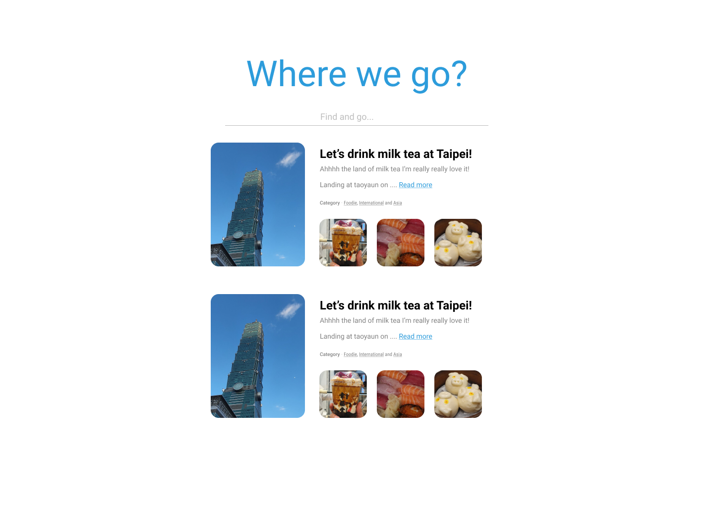
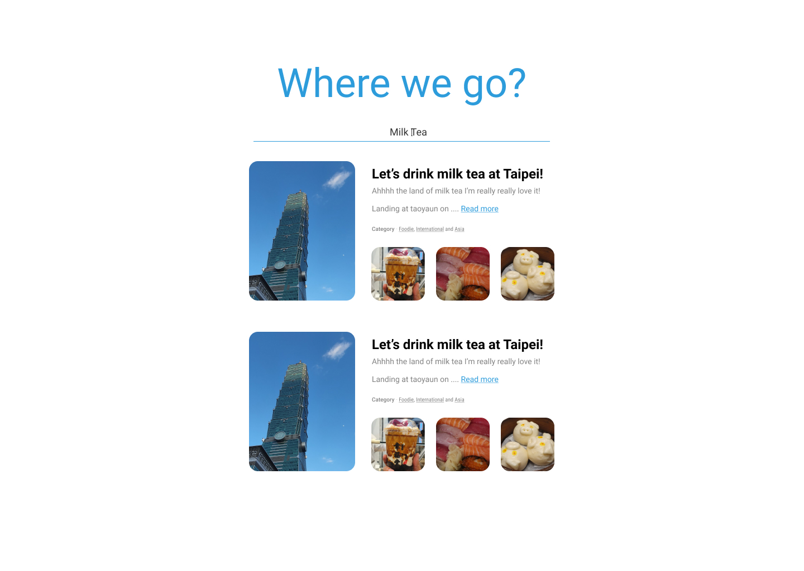

# Frontend Assignment

This is an assignment for Software Engineer, Frontend candidate. The candidate should keep in mind about the following 3 rules below during the period of completing assignment, because we believe that software development is not only finished by completing all requirements, but it should be good for user and the best for long term maintenance in the future.

## 3 Rules for Doing Great in this assignment

### 1. WTF per minute

http://commadot.com/wtf-per-minute/

If you asked for code reviewing from your friend and your friend said WTF are you doing, this mean your code quality is so bad.

During the period of coding, you should keep in mind that you work with others, so your code should be written readable and definite what does it used for.

> “Indeed, the ratio of time spent reading versus writing is well over 10 to 1. We are constantly reading old code as part of the effort to write new code. ...[Therefore,] making it easy to read makes it easier to write.” - Robert C. Martin

### 2. Bug happen & you always know!

The program that you complete may necessitate maintenance for serveral months or years. How you can ensure that your code will always work correct?

Please write the tests those cover and ensure your code work correctly. Moreover using dev tool to check that you program work correct before you broke it in production. Somehow logging the right error, this can help you a lot.

### 3. Happy User

Please always develop the great user experience (UX) web application. Be thinking that you are an user, the application should be used by yourself happily without issue. You might seeking for some best practices and apply it on your work.

## Assignment "Where we go?"

### Task 1: API-Gateway

The software engineer, frontend at LMWN has the responsibility to maintain and develop web application and API-Gateway, because of the API-Gateway is the center point that collect all the response from many micro services and serve it to frontend.

In this task, you have to create the api-gateway server to collect the data from JSON server and send it to frontend as the requirement in the following section.

#### Requirements

Create search API that uses the keyword from client to find the suitable trip from JSON Server API.

The searching will be applied with title, description and tag from JSON data.

The API should response a list of trip object that match to the keyword user search. Please ensure that the API you write always work correctly.

##### Example

```
GET /api/trips?keyword=ภูเขา

Response Status 200:

{
    "trips": [
        {
            "title": "Koh Chang Travel, Guide Eat Travel Stay? All in one here!",
            "eid": "1",
            "url": "https://www.wongnai.com/trips/travel-koh-chang",
            "description": "Let's go Koh Change on your chilling day. Many activities at here like visiting waterfall, floating around mangrove forest, riding the elephant, adventuring in the forest, and shallow diving. This is fun trip for sure!\n\n“Koh Change” Trad, the Bangkok nearby sea. Visitable every season. Clear your work, pack you bag, ready, go! Koh Chang travel guide, where to eat, stay or visit? All of them at here!",
            "photos": [
                "https://img.wongnai.com/p/1600x0/2019/07/02/3c758646aa6c426ba3c6a81f57b20bd6.jpg",
                "https://img.wongnai.com/p/1600x0/2019/07/02/6a2733ab91164ac8943b77deb14fdbde.jpg",
                "https://img.wongnai.com/p/1600x0/2019/07/02/941dbb607f0742bbadd63bbbd993e187.jpg",
                "https://img.wongnai.com/p/1600x0/2019/07/02/bd1d256256c14c208d0843a345f75741.jpg"
            ],
            "tags": [
                "Island",
                "Sea",
                "Sightseeing",
                "Nature",
                "Trad"
            ]
        },
        {
            "title": "10 Places to visit around BTS Green line!",
            "eid": "2",
            "url": "https://www.wongnai.com/trips/new-bts-route-trips",
            "description": "BTS Green lines open 5 new stations. Let's go update the newest cool check-in point.\n\nStart with 'Ha Yaek Lardprao' the connected station with Central Plaza Lardprao which is the full service mall. However, we don't let you travel on the mall, you come to here! Let's go to the another level adventure fun activities then follow by chill relaxing cafe.",
            "photos": [
                "https://img.wongnai.com/p/1600x0/2020/02/18/458b9a31b62b408d91137fbe152f7450.jpg",
                "https://img.wongnai.com/p/1600x0/2020/02/18/08bca1c784db4d7f92e93656b5376681.jpg",
                "https://img.wongnai.com/p/1600x0/2020/02/18/95bd2ca371e24436bcb24d432a86836c.jpg",
                "https://img.wongnai.com/p/1600x0/2020/02/18/68289e188ea54e00b5e9d806cfd0fc54.jpg"
            ],
            "tags": [
                "Cafe",
                "Coffee",
                "Attraction",
                "Bangkok Nearby",
                "Bangkok"
            ]
        }
    ]
}
```

#### JSON Server

How to run json server

```
cd json-server
npm i // or yarn
npm start:en
```

The JSON Server will be run on port 9000.

##### API Spec

```
GET /trips

Response Status 200:
[
    {
        "title": "Koh Chang Travel, Guide Eat Travel Stay? All in one here!",
        "eid": "1",
        "url": "https://www.wongnai.com/trips/travel-koh-chang",
        "description": "Let's go Koh Change on your chilling day. Many activities at here like visiting waterfall, floating around mangrove forest, riding the elephant, adventuring in the forest, and shallow diving. This is fun trip for sure!\n\n“Koh Change” Trad, the Bangkok nearby sea. Visitable every season. Clear your work, pack you bag, ready, go! Koh Chang travel guide, where to eat, stay or visit? All of them at here!",
        "photos": [
            "https://img.wongnai.com/p/1600x0/2019/07/02/3c758646aa6c426ba3c6a81f57b20bd6.jpg",
            "https://img.wongnai.com/p/1600x0/2019/07/02/6a2733ab91164ac8943b77deb14fdbde.jpg",
            "https://img.wongnai.com/p/1600x0/2019/07/02/941dbb607f0742bbadd63bbbd993e187.jpg",
            "https://img.wongnai.com/p/1600x0/2019/07/02/bd1d256256c14c208d0843a345f75741.jpg"
        ],
        "tags": [
            "Island",
            "Sea",
            "Sightseeing",
            "Nature",
            "Trad"
        ]
    }
]
```

### Task 2: React Web Application


Developing the web application is main responsibility of software engineer, frontend at LMWN. The main web technology we use is React.

In this task, you have to develop trip searching web application for our lovely user to find some experience or review before deciding where they will go for vacation.

Please always develop the great UX application! You can add or change the feature different from example design that we provided to improve the UX and performance of web application.

#### Requirement

Develop web application for trip searching by a keyword from user input like the following design and integrate the API that you completed in the first task above.




For the displaying of trip data, the minimum requirements that you have to complete are as follows:

- [ ] Navigate to the url from trip data when click the trip name.
- [ ] Navigate to the url from trip data when click on read more text.
- [ ] Display the image that attract user to click on the trip.
- [ ] Search the keyword as tag when click on the tag display in trip.
- [ ] User can share the link of current search and send to their friends to see the same result.
- [ ] The trip description will be max displayed in two lines.

## Period of completion

In fact, this assignment can be completed within 1 - 2 days. By the way, we give the candidate 10 days to complete this assignment which started from the date you receive this assignment.
